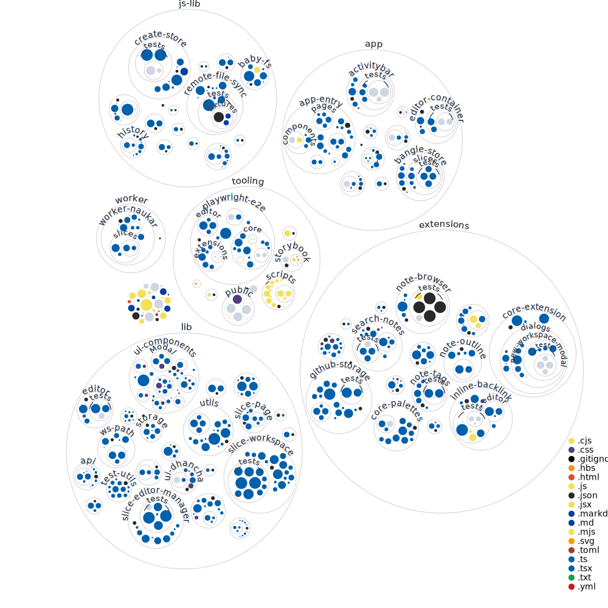

# Contributing

This document covers how to setup [bangle.io](http://bangle.io) locally and also a brief overview of its architecture.

> Please, note this document is work in progress :nail_care: !

## Setup

### Prerequisites

- [Nodejs](https://nodejs.org/en/download/) > 18.0

- [Yarn](https://yarnpkg.com/) v3

### Local development

- `yarn install` to install

- `yarn start` to start bangle on `localhost:4000`

- `yarn test:regular`\: To run the regular tests.

- `yarn test:network`\: To run the network based tests. Please note these tests will hit Github API and may **create bunch of test repositories**. Make sure you have `GITHUB_OWNER` and `GITHUB_TOKEN` set in your environment variables.

- `yarn g:playwright-dep` to install playwright dependencies if you want to run e2e testing.

- `yarn g:e2e` to run the e2e tests.

- `yarn lint` to run all of the linters.

- `yarn build` to build the application for production.

- `yarn g:build-prod-serve` to start a production optimized version of bangle on `localhost:1234`.

- `yarn g:run-scripts` to run all of the scripts in the `tooling/_scripts`. This is helpful to update any autogenerated code.

### Yarn and Typescript version

- Run `yarn dlx @yarnpkg/sdks` to sync typescript for VSCode locally.
- Follow the guide here to setup VSCode properly <https://yarnpkg.com/getting-started/editor-sdks#vscode>

## E2E Tests

### Updating the snapshots

Playwright creates two types of snapshots, one for mac (darwin) and other for linux. If you are running the tests on a mac, you will have to update the darwin snapshots.

Run the following in mac to update linux snapshots:

```bash
docker run -v $(pwd):/work/ mcr.microsoft.com/playwright:v1.39.0-focal bash -c 'cd work && yarn install &&  yarn g:playwright-dep && NODE_OPTIONS="--max-old-space-size=8144"  yarn g:e2e '
```

If you are running the tests on a linux machine, you will have to update the darwin snapshots. I haven't found a way to run the tests on a linux machine and update the darwin snapshots. Please open an issue if you have any ideas on how to deal with this.

### Updating Playwright version

Search the code base (excluding `.yarn` and lock files)  for the currently installed version of the playwright and then replace it with the new version.

# Architecture



The repository is divided into multiple smaller node packages which are linked to each other via `yarn`.

### Directory structure

Bangle has the following top level directories containing smaller packages.

- `extensions:`All of the first party extensions sit here. If you are fixing a bug or extending a feature, you will most likely start here.

- `lib:` The packages that are shared across the app.

- `js-lib:` Independent packages that have no awareness of bangle and have no dependency on any other part of the code.

- `app:` The core app that bootstraps everything sits here.

- `worker:` Separate directory for any code that will be run the web worker.

- `tooling:` Focused on things like integration tests, scripts etc. Any code in here is not bundled in the production app.

### Extension file structure

Each extension must have the following top level files:

- `index.ts` The entry point for the extension.
- `style.css` A single css file containing all the styles of your extension.
- `style.ts`\: A file which `imports` the `style.css` file.

**Please note** your `index.ts` file should not import `style.ts`. This restriction exists to keep the imports within the realms of standard Javascript.

### Styling and design tokens

- Bangle.io uses [unocss](https://github.com/unocss/unocss) an atomic css library which has tailwind like API. It is strongly recommended to use the [editor extension](https://marketplace.visualstudio.com/items?itemName=antfu.unocss) to get autocompletion for the css classes.

- We generate the css variables ( `yarn g:generate-core-theme`) from the design tokens described in [design-tokens.ts](https://github.com/bangle-io/bangle-io/blob/dev/lib/shared-types/design-tokens.ts). These tokens are then passed to unocss to generate the atomic css classes and css variables.

- If you cannot use the atomic css classes for some reason, you can directly import the variable by doing `import {vars} from '@bangle.io/css-vars'` in typescript or `var(--BV-myVariable)` in CSS. All design tokens are prefixed with `--BV-` followed by the name of the token.

- **Not recommended** if you are going to create a custom CSS class name, make sure it is prefixed with a `B-` followed by the extension name / package name followed by a `_` and then a valid string. For example `B-my-extension_my-class`. A utility class helper starts with `BU_` followed by the name of the helper, for example, `BU_my-helper`.

- **Not recommended** but for some reason if you want to use a custom css variable outside of the provided design tokens, you can use `BC-` followed by the name of the variable, for example, `var(--BC-myVariable)`. If you do not use this syntax, the linter will throw an error.

### Contexts

Bangle uses a concept of context for sharing state across the extensions.

- `editor-manager-context` exposes the Editors.
- `extension-registry-context`\: the glue code for the extension. If you are developing an extension you can ignore this.
- `page-context` for pending writes, page lifecycle, navigation etc.
- `serial-operation-context` for dispatching serial Operations.
- `ui-context` provides the UI state information, like sidebars, palettes etc.
- `workspace-context`\: place for centralized workspace ops like note creation, renaming, deletion etc.

## Operations

Operations are used across bangle to dispatch complex state changes with the help of actions.

Operations exist in two different forms:

- Functional operations have the signature `(...parms) => (state, dispatch, store?) => {}`.
- Serial operations, similar to functional operation but have a serializable notation so that they can be executed in contexts where functions are not possible, for example the `Operation Palette` UI. See this [extension's code](https://github.com/bangle-io/bangle-io/blob/dev/extensions/core-actions/index.ts) to get a rough idea.

## WsPaths

A file path in Bangle is denoted by a string with the following syntax:

- `wsPath`\: A unique string representing a file and its workspace. `hello:foo/bar.md`.

- `wsName`\: Workspace name, in `hello:foo/bar.md` `hello` is the workspace name.

## How editor opens a file?

1. User somehow clicks on a file and triggers pushWsPath
2. That then becomes a wsPath derived from history.location
3. An `<Editor />` gets mounted with new wsPath
4. At this point the editor is loaded with empty doc.
5. `@bangle.dev/core-editor`'s collab-client sets up communication with worker thread.
6. Worker thread has a collab-manager instance running.
7. When collab-client calls getDocument, it is passed on to worker thread's manager
8. manager calls localDisk.getItem to get the document from indexdb.
9. Collab-client plugin refreshes the editor with correct content.
